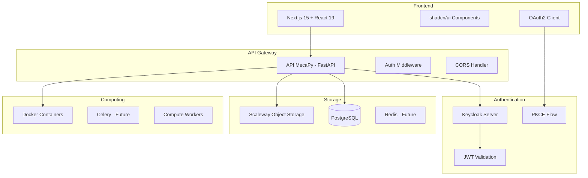
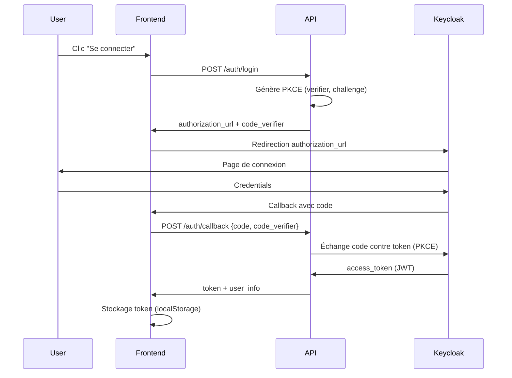
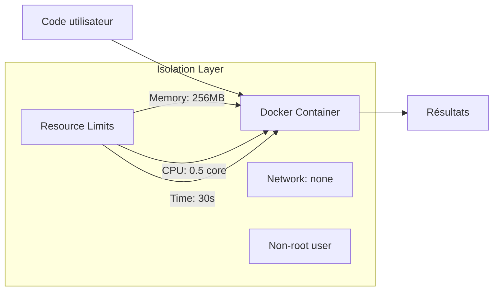
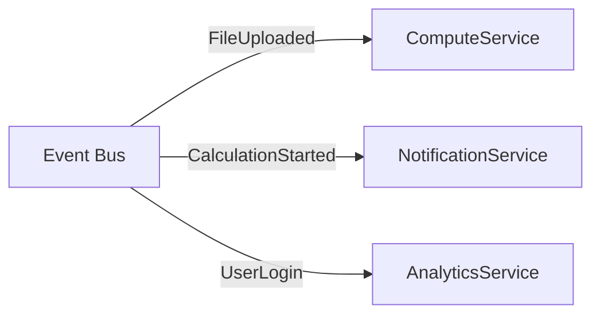
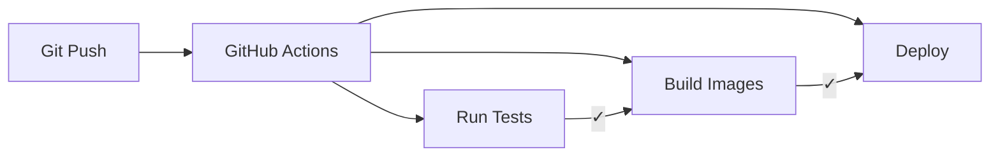

# Architecture MecaPy

## Vue d'ensemble

MecaPy est une plateforme de calcul scientifique moderne construite avec une architecture microservices découplée, combinant sécurité, scalabilité et facilité d'utilisation.

## Architecture générale



## Composants principaux

### 1. Frontend (Next.js)

**Localisation** : `repos/frontend/`

**Technologies** :
- **Framework** : Next.js 15.2.4 avec App Router
- **UI Library** : React 19 + shadcn/ui + Radix UI
- **Styling** : Tailwind CSS avec support mode sombre
- **State Management** : React hooks + Context API
- **Forms** : react-hook-form + zod validation
- **Package Manager** : pnpm

**Architecture** :
```
frontend/
├── app/                 # App Router (Next.js 13+)
│   ├── layout.tsx      # Layout racine
│   ├── page.tsx        # Page d'accueil
│   └── settings/       # Pages configurattion
├── components/         # Composants réutilisables
│   ├── ui/            # Composants shadcn/ui
│   ├── app-header.tsx
│   ├── app-sidebar.tsx
│   └── theme-provider.tsx
├── hooks/             # Hooks React custom
├── lib/               # Utilitaires et config
└── public/            # Assets statiques
```

**Responsabilités** :
- Interface utilisateur responsive
- Authentification OAuth2 + PKCE
- Upload et gestion des fichiers
- Visualisation des résultats de calcul
- Gestion des thèmes (clair/sombre)

### 2. API Backend (FastAPI)

**Localisation** : `repos/api/`

**Technologies** :
- **Framework** : FastAPI 0.110+ avec OpenAPI
- **ORM** : SQLModel (SQLAlchemy + Pydantic)
- **Validation** : Pydantic v2
- **Tests** : pytest + pytest-asyncio
- **Linting** : ruff + mypy
- **Package Manager** : uv

**Architecture** :
```
api/
├── mecapy_api/
│   ├── main.py           # Point d'entrée FastAPI
│   ├── config.py         # Configuration environnement
│   ├── auth/            # Module authentification
│   │   ├── middleware.py # Middleware JWT + sécurité
│   │   ├── service.py   # Validation JWT
│   │   └── models.py    # Modèles auth
│   ├── routes/          # Endpoints API
│   │   ├── auth.py      # Routes authentification
│   │   └── upload.py    # Routes upload fichiers
│   └── models/          # Modèles données
└── tests/               # Tests automatisés
```

**Responsabilités** :
- API REST avec documentation OpenAPI
- Authentification JWT avec Keycloak
- Upload sécurisé vers Object Storage
- Validation et sérialisation des données
- Middleware de sécurité (CORS, headers)

### 3. Authentification (Keycloak)

**Architecture OAuth2 + PKCE** :



**Configuration Keycloak** :
- **Realm** : `mecapy`
- **Client ID** : `mecapy-api`
- **Grant Type** : Authorization Code + PKCE
- **Token Format** : JWT avec RS256

### 4. Stockage

#### Base de données (PostgreSQL)
- **Utilisateurs** : Référence Keycloak + métadonnées
- **Fichiers** : Métadonnées avec références S3
- **Calculs** : Historique et résultats
- **Outils** : Définitions outils scientifiques

#### Object Storage (Scaleway)
- **Bucket** : `mecapy-uploads`
- **Structure** : `/{user_id}/{filename}`
- **SDK** : boto3 (compatible S3)
- **Sécurité** : Accès via IAM credentials

### 5. Calculs sécurisés (Futur)

**Architecture Docker** (inspirée Scientific-Platform) :



**Sécurité** :
- Conteneurs isolés sans accès réseau
- Limites strictes de ressources
- Utilisateur non-privilégié
- Validation statique du code
- Timeout automatique

## Patterns d'architecture

### 1. Clean Architecture

```
┌─── Presentation Layer ───┐
│   Frontend (Next.js)     │
└───────────────────────────┘
            │
┌─── Application Layer ────┐
│   API Routes (FastAPI)   │
│   Middleware             │
└───────────────────────────┘
            │
┌─── Domain Layer ─────────┐
│   Business Logic         │
│   Models & Services      │
└───────────────────────────┘
            │
┌─── Infrastructure Layer ─┐
│   Database (PostgreSQL)  │
│   Storage (S3)           │
│   Auth (Keycloak)        │
└───────────────────────────┘
```

### 2. Microservices

**Services actuels** :
- **API Service** : FastAPI backend
- **Frontend Service** : Next.js application
- **Auth Service** : Keycloak (externe)
- **Storage Service** : Scaleway Object Storage

**Services futurs** :
- **Compute Service** : Exécution calculs Docker
- **Notification Service** : Notifications temps réel
- **Analytics Service** : Métriques et monitoring

### 3. Event-Driven (Futur)



## Sécurité

### 1. Authentification et autorisation

**JWT Validation** :
- Signature RS256 avec clés publiques JWKS
- Vérification expiration, audience, issuer
- Middleware automatique sur routes protégées

**PKCE (Proof Key for Code Exchange)** :
- Protection contre interception code authorization
- Code verifier/challenge généré côté client
- Échange sécurisé même sans client secret

### 2. Transport et données

**HTTPS/TLS** :
- Certificats SSL/TLS obligatoires en production
- Headers de sécurité (HSTS, CSP, X-Frame-Options)
- CORS configuré restrictivement

**Validation données** :
- Pydantic pour validation API
- Zod pour validation frontend
- Sanitisation inputs utilisateur

### 3. Infrastructure

**Isolation** :
- Conteneurs Docker pour calculs
- Network isolation (mode: none)
- Resource limits (CPU, memory, time)

**Secrets Management** :
- Variables d'environnement
- Pas de secrets en dur dans le code
- Rotation régulière des clés

## Scalabilité

### 1. Horizontal scaling

**API** :
- Stateless FastAPI instances
- Load balancer (nginx/HAProxy)
- Database connection pooling

**Frontend** :
- Static site generation (SSG)
- CDN pour assets statiques
- Edge deployment (Vercel/Netlify)

### 2. Vertical scaling

**Database** :
- PostgreSQL avec read replicas
- Connection pooling (pgbouncer)
- Query optimization et indexing

**Storage** :
- Object storage scalable (Scaleway)
- CDN pour delivery fichiers
- Compression et déduplication

### 3. Caching (Futur)

**Redis Cache** :
- JWT validation cache
- User session cache
- Computation results cache
- Rate limiting

## Monitoring et observabilité

### 1. Logging

**Structure** :
```json
{
  "timestamp": "2024-01-15T10:30:00Z",
  "level": "INFO",
  "service": "mecapy-api",
  "request_id": "req_123456",
  "user_id": "user_789",
  "endpoint": "/upload",
  "method": "POST",
  "status_code": 200,
  "duration_ms": 150,
  "message": "File uploaded successfully"
}
```

### 2. Métriques (Futur)

**Application Metrics** :
- Request latency et throughput
- Error rates par endpoint
- User activity metrics
- Storage utilization

**Infrastructure Metrics** :
- CPU, memory, disk usage
- Database performance
- Network latency
- Container health

### 3. Distributed Tracing (Futur)

**OpenTelemetry** :
- Request tracing across services
- Performance bottleneck identification
- Error propagation tracking

## Déploiement

### 1. Environnements

```
Development → Testing → Staging → Production
     ↓           ↓        ↓          ↓
   localhost   CI/CD    Preview    Live
```

### 2. Infrastructure as Code

**Docker Compose** (développement) :
```yaml
services:
  api:
    build: ./repos/api
    environment:
      - DATABASE_URL=postgresql://...
      - KEYCLOAK_URL=http://keycloak:8080
  
  frontend:
    build: ./repos/frontend
    environment:
      - NEXT_PUBLIC_API_URL=http://api:8000
  
  keycloak:
    image: quay.io/keycloak/keycloak
    environment:
      - KEYCLOAK_ADMIN=admin
```

**Production** :
- **API** : Clever Cloud (Platform-as-a-Service)
- **Frontend** : Vercel/Netlify (Static hosting)
- **Database** : Managed PostgreSQL
- **Storage** : Scaleway Object Storage

### 3. CI/CD Pipeline



**GitHub Actions** :
- Tests automatisés (backend + frontend)
- Build et push Docker images
- Déploiement automatique
- Security scanning

## Migration et évolution

### 1. Database Migrations

**Alembic** (SQLAlchemy) :
- Versioning schéma base de données
- Migrations automatiques et manuelles
- Rollback capabilities

### 2. API Versioning

**Header-based** :
```http
Accept: application/vnd.mecapy.v1+json
```

**URL-based** (futur) :
```
/api/v1/users
/api/v2/users
```

### 3. Feature Flags (Futur)

**Progressive rollout** :
- Activation graduelle nouvelles fonctionnalités
- A/B testing
- Rollback instantané si problèmes

## Bonnes pratiques

### 1. Code Quality

- **Type Safety** : TypeScript (frontend) + mypy (backend)
- **Linting** : ESLint + ruff
- **Testing** : Jest + pytest avec >80% coverage
- **Documentation** : OpenAPI + Storybook

### 2. Security

- **Principle of Least Privilege** : Permissions minimales
- **Defense in Depth** : Sécurité multi-couches
- **Regular Updates** : Dépendances et security patches
- **Security Scanning** : Automated vulnerability detection

### 3. Performance

- **Lazy Loading** : Composants et données
- **Caching** : Multiple levels (browser, CDN, application)
- **Optimization** : Bundle size, image compression
- **Database** : Query optimization, proper indexing

---

**Version** : 1.0.0  
**Dernière mise à jour** : 2024-01-15