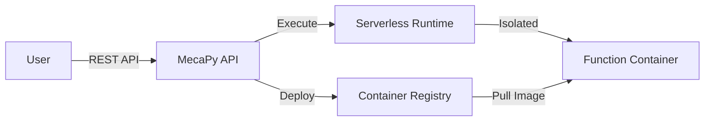

# Welcome to MecaPy

> Modern scientific computing platform for engineering calculations

## What is MecaPy?

MecaPy is a **serverless scientific computing platform** that enables engineers and researchers to:

- 🚀 **Deploy scientific functions** as serverless APIs
- 📦 **Package Python calculations** with automatic versioning
- 🔐 **Secure execution** in isolated containers
- 📊 **Scale automatically** based on demand
- 🌐 **Access via REST API** or Python SDK

## Key Features

### Function Packaging

Write scientific calculations in Python and package them with a simple YAML manifest:

```yaml
# mecapy.yml
name: structural-analysis
description: Bolted connection calculations

functions:
  calculate-bolt-resistance:
    handler: analysis.bolt.Bolt:calculate_resistance
    init: [diameter, material_grade]
```

**Learn more**: [Manifest Format](packages/MANIFEST_FORMAT)

### Type-Safe Parameters

Use standard types with automatic JSON Schema validation:

```python
from typing import Annotated, Literal
from pydantic import Field

def calculate(
    diameter: Annotated[float, Field(
        description="Bolt diameter in mm",
        ge=6,
        le=100
    )],
    grade: Literal["4.6", "5.6", "8.8", "10.9"]
) -> dict:
    """Calculate bolt resistance."""
    ...
```

**Learn more**: [Standard Types Guide](packages/STANDARD_TYPES_GUIDE)

### Automatic Versioning

Functions are versioned automatically using source code checksums:

```
function_id: calculate-bolt-resistance
version: 1.0.0-a3f2b8c1d4e5
```

Users can pin specific versions or use latest automatically.

**Learn more**: [Versioning Strategy](packages/VERSIONING_STRATEGY)

### Serverless Execution

Functions run in isolated containers with:

- ✅ CPU and memory limits
- ✅ Timeout protection
- ✅ Automatic scaling
- ✅ Git-based deployment
- ✅ Container registry caching

**Learn more**: [Architecture](architecture/architecture_finale_sans_limite)

## Quick Start

### 1. Install Python SDK

```bash
pip install mecapy-sdk
```

### 2. Authenticate

```python
from mecapy import Client

# Service account (for automation)
client = Client.from_service_account("your-token")

# OAuth2 (for interactive use)
client = Client.from_oauth2()
```

### 3. Call Functions

```python
# Execute function
result = client.functions.execute(
    function_id="calculate-bolt-resistance",
    version="1.0.0",
    inputs={
        "diameter": 12,
        "grade": "8.8",
        "force": 50000
    }
)

print(result.data)
# {'resistance': 62000, 'utilization': 0.81, 'status': 'OK'}
```

### 4. Deploy Your Own Functions

```bash
# Create package structure
mecapy init my-package

# Deploy from Git repository
mecapy deploy --git-url https://github.com/user/my-package
```

**Learn more**: [Quick Start Guide](QUICKSTART)

## Architecture Overview



**Key components**:

- **API Gateway**: FastAPI with OAuth2 authentication
- **Container Registry**: GitHub Container Registry (GHCR)
- **Execution Engine**: Scaleway Serverless Containers
- **Storage**: Scaleway Object Storage (S3-compatible)
- **Auth**: Keycloak OAuth2 + PKCE

**Learn more**: [Architecture Details](architecture)

## Use Cases

### Structural Engineering

Calculate resistance of bolted connections, welded joints, steel beams, etc.

```python
result = client.functions.execute(
    "eurocode3-bolt-resistance",
    inputs={"diameter": 16, "nb_bolts": 4}
)
```

### Mechanical Design

Analyze stress, deformation, fatigue, etc.

```python
result = client.functions.execute(
    "mechanical-stress-analysis",
    inputs={"force": 10000, "section": "rectangular"}
)
```

### Data Processing

Process scientific data, run simulations, generate reports.

```python
result = client.functions.execute(
    "data-analysis-pipeline",
    inputs={"dataset_url": "s3://..."}
)
```

## Developer Resources

### Package Development

- [Manifest Format](packages/MANIFEST_FORMAT) - Package configuration
- [Standard Types](packages/STANDARD_TYPES_GUIDE) - Type system reference
- [Multi-Function Packages](packages/PACKAGE_MULTI_FUNCTIONS) - Advanced patterns
- [Versioning](packages/VERSIONING_STRATEGY) - Version management

### API Reference

- [API Specifications](api-reference/api-specifications) - REST API endpoints
- [Authentication](api-reference/authentication-providers) - OAuth2 setup
- [Database Schema](api-reference/database-schema) - Data models

### Deployment

- [Container Registry](ci-cd/container_registry_strategy) - GHCR setup
- [CI/CD Workflow](ci-cd/registry_cicd_workflow) - Automation
- [Deployment Guide](deployment) - Production setup

## Community

- **GitHub**: [github.com/mecapy](https://github.com/mecapy)
- **Discord**: [discord.gg/mecapy](https://discord.gg/mecapy)
- **Support**: support@mecapy.com

## Get Started

Ready to deploy your first scientific function?

<Card title="Quick Start Guide" icon="rocket" href="QUICKSTART">
  Learn how to create and deploy your first MecaPy package
</Card>

<Card title="Package Development" icon="code" href="packages/MANIFEST_FORMAT">
  Dive into package development with the manifest format
</Card>

<Card title="Architecture" icon="building" href="architecture">
  Understand the platform architecture
</Card>

---

**Let's build the future of scientific computing together!** 🚀
