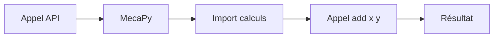
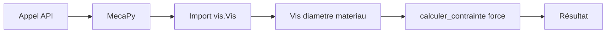
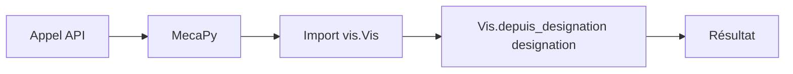

## Qu'est-ce qu'un handler ?

Le **handler** est le chemin vers votre fonction ou méthode Python. Il indique à MecaPy quelle fonction appeler.

```yaml
handler: module.Class:method
         └─────┬────┘ └──┬──┘
          Module      Callable
```

## Types de handlers

<CardGroup cols={2}>
  <Card title="Fonction simple" icon="function">
    La plus simple : une fonction Python
  </Card>
  <Card title="Méthode d'instance" icon="cube">
    Méthode d'une classe (nécessite `init`)
  </Card>
  <Card title="Classmethod" icon="code-branch">
    Méthode de classe avec `@classmethod`
  </Card>
  <Card title="Classe callable" icon="box">
    Classe avec méthode `__call__`
  </Card>
</CardGroup>

## 1. Fonction simple

### Format
```yaml
handler: module:function
```

### Exemple

<CodeGroup>

```yaml mecapy.yml
functions:
  addition:
    handler: calculs:add
```

```python calculs.py
def add(x: float, y: float) -> float:
    """Additionne deux nombres."""
    return x + y
```

</CodeGroup>

### Comportement



<Note>
  **Pas besoin de `init`** pour les fonctions simples.
</Note>

## 2. Méthode d'instance

### Format
```yaml
handler: module.Class:method
init: [param1, param2]  # Requis !
```

### Exemple

<CodeGroup>

```yaml mecapy.yml
functions:
  calcul-contrainte:
    handler: vis.Vis:calculer_contrainte
    init: [diametre, materiau]
```

```python vis.py
class Vis:
    def __init__(self, diametre: float, materiau: str):
        """Initialise une vis."""
        self.diametre = diametre
        self.materiau = materiau

    def calculer_contrainte(self, force: float) -> dict:
        """Calcule la contrainte de traction."""
        aire = 3.14 * (self.diametre / 2) ** 2
        return {
            "contrainte": force / aire,
            "unite": "MPa"
        }
```

</CodeGroup>

### Comportement



L'utilisateur appelle avec :
```json
{
  "diametre": 12,
  "materiau": "acier",
  "force": 5000
}
```

MecaPy exécute :
```python
vis = Vis(diametre=12, materiau="acier")
result = vis.calculer_contrainte(force=5000)
```

<Warning>
  Le paramètre `init` est **obligatoire** pour les méthodes d'instance !
</Warning>

### Format de init

<Tabs>
  <Tab title="Liste simple">
    ```yaml
    init: [diametre, materiau]
    ```
    Les valeurs viennent directement des inputs.
  </Tab>
  <Tab title="Mapping">
    ```yaml
    init:
      diametre: "{inputs.diametre}"
      materiau: "{inputs.materiau}"
      longueur: 100  # Valeur fixe
    ```
  </Tab>
  <Tab title="Transformation">
    ```yaml
    init:
      diametre: "{inputs.diametre_mm}"
      materiau: "get_materiau({inputs.code})"
    ```
  </Tab>
</Tabs>

## 3. Classmethod

### Format
```yaml
handler: module.Class:classmethod
# Pas besoin de init !
```

### Exemple

<CodeGroup>

```yaml mecapy.yml
functions:
  creation-vis:
    handler: vis.Vis:depuis_designation
```

```python vis.py
class Vis:
    def __init__(self, diametre: float, materiau: str):
        self.diametre = diametre
        self.materiau = materiau

    @classmethod
    def depuis_designation(cls, designation: str) -> "Vis":
        """
        Crée une vis depuis sa désignation.

        Parameters
        ----------
        designation : str
            Désignation (M8, M12, M16, etc.)

        Returns
        -------
        Vis
            Instance de vis créée
        """
        diametre = int(designation[1:])
        return cls(diametre, "acier")

    def calculer_contrainte(self, force: float) -> dict:
        """Calcule la contrainte."""
        aire = 3.14 * (self.diametre / 2) ** 2
        return {"contrainte": force / aire}
```

</CodeGroup>

### Comportement



L'utilisateur appelle avec :
```json
{
  "designation": "M12"
}
```

MecaPy exécute :
```python
result = Vis.depuis_designation(designation="M12")
```

<Tip>
  Les `@classmethod` sont parfaits pour les **factory methods** (création d'instances).
</Tip>

## 4. Classe callable

### Format
```yaml
handler: module.Class
# La classe doit avoir __call__
```

### Exemple

<CodeGroup>

```yaml mecapy.yml
functions:
  calculateur:
    handler: calculator.Calculator
```

```python calculator.py
class Calculator:
    """Calculateur avec état."""

    def __init__(self):
        self.history = []

    def __call__(self, operation: str, x: float, y: float) -> float:
        """
        Exécute une opération.

        Parameters
        ----------
        operation : str
            Opération (add, sub, mul, div)
        x : float
            Premier nombre
        y : float
            Second nombre

        Returns
        -------
        float
            Résultat de l'opération
        """
        if operation == "add":
            result = x + y
        elif operation == "sub":
            result = x - y
        elif operation == "mul":
            result = x * y
        elif operation == "div":
            result = x / y
        else:
            raise ValueError(f"Opération inconnue: {operation}")

        self.history.append((operation, x, y, result))
        return result
```

</CodeGroup>

<Note>
  La classe doit implémenter `__call__` pour être callable.
</Note>

## Modules imbriqués

Tous les formats supportent les modules imbriqués.

### Exemples

```yaml
# Module simple
handler: calculs:add

# Module imbriqué - fonction
handler: package.subpackage.module:function

# Module imbriqué - méthode
handler: package.subpackage.vis.Vis:calculer_contrainte
init: [diametre, materiau]

# Module imbriqué - classmethod
handler: package.subpackage.vis.Vis:depuis_designation
```

## Tableau récapitulatif

| Type | Format | `init` requis ? | Exemple |
|------|--------|----------------|---------|
| **Fonction** | `module:function` | ❌ Non | `calculs:add` |
| **Méthode** | `module.Class:method` | ✅ **Oui** | `vis.Vis:calculer_contrainte` |
| **Classmethod** | `module.Class:classmethod` | ❌ Non | `vis.Vis:depuis_designation` |
| **Callable** | `module.Class` | ❌ Non | `calculator.Calculator` |

## Erreurs courantes

<AccordionGroup>
  <Accordion title="Méthode sans init" icon="triangle-exclamation">
    **Erreur** :
    ```yaml
    handler: vis.Vis:calculer_contrainte
    # Manque init !
    ```

    **Solution** :
    ```yaml
    handler: vis.Vis:calculer_contrainte
    init: [diametre, materiau]  # ✅
    ```
  </Accordion>

  <Accordion title="Mauvais séparateur" icon="triangle-exclamation">
    **Erreur** :
    ```yaml
    handler: vis.Vis.calculer_contrainte  # ❌ Point au lieu de :
    ```

    **Solution** :
    ```yaml
    handler: vis.Vis:calculer_contrainte  # ✅ Deux-points
    ```
  </Accordion>

  <Accordion title="Classmethod avec init" icon="triangle-exclamation">
    **Erreur** :
    ```yaml
    handler: vis.Vis:depuis_designation
    init: [designation]  # ❌ Pas nécessaire
    ```

    **Solution** :
    ```yaml
    handler: vis.Vis:depuis_designation  # ✅ Sans init
    ```
  </Accordion>

  <Accordion title="Classe non callable" icon="triangle-exclamation">
    **Erreur** :
    ```python
    class MyClass:
        def process(self, x):  # ❌ Pas de __call__
            return x * 2
    ```
    ```yaml
    handler: module.MyClass  # ❌ Erreur au runtime
    ```

    **Solution** :
    ```python
    class MyClass:
        def __call__(self, x):  # ✅ Méthode __call__
            return x * 2
    ```
    Ou utiliser la méthode :
    ```yaml
    handler: module.MyClass:process  # ✅
    init: []  # Si pas de __init__
    ```
  </Accordion>
</AccordionGroup>

## Bonnes pratiques

<Steps>
  <Step title="Privilégier les fonctions simples">
    Pour les cas simples, une fonction suffit. Pas besoin de classe.
  </Step>
  <Step title="Utiliser les classmethods pour les factories">
    Créer des instances avec différentes configurations.
  </Step>
  <Step title="Méthodes pour l'état partagé">
    Quand plusieurs paramètres sont utilisés par plusieurs méthodes.
  </Step>
  <Step title="Type hints partout">
    Sur toutes les fonctions/méthodes pour l'auto-introspection.
  </Step>
</Steps>

## Prochaines étapes

<CardGroup cols={2}>
  <Card
    title="Auto-introspection"
    icon="wand-magic-sparkles"
    href="/manifest/schemas"
  >
    Comment les schemas sont générés automatiquement
  </Card>
  <Card
    title="Exemples"
    icon="code"
    href="/manifest/examples"
  >
    Cas d'usage complets avec handlers
  </Card>
</CardGroup>
